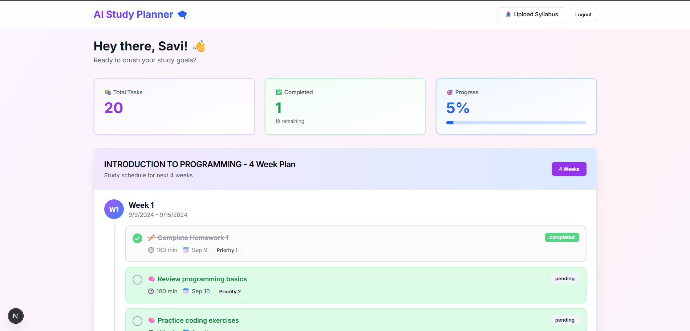

# AI-Powered Student Study Planner

An intelligent full-stack application that uses AI agents to parse course syllabi, generate personalized study schedules, and continuously adapt based on user feedback.



## Features

- **AI Syllabus Parser** - Upload PDF/DOCX syllabi, AI extracts assignments and deadlines
- **Smart Schedule Generator** - Personalized 4-week study plans based on your preferences
- **Progress Tracking** - Visual dashboard with task completion stats
- **Self-Improving AI** - Learns from your feedback and adjusts future plans
- **Interactive Tasks** - Click to edit, mark complete, add notes
- **Beautiful UI** - Colorful, playful design with smooth animations

## Architecture

**3-Agent AI System:**
- **Parser Agent** - Extracts structured data from syllabi
- **Planner Agent** - Generates personalized study schedules
- **Reflector Agent** - Analyzes feedback and adjusts plans

**Tech Stack:**
- **Backend:** Python, FastAPI, PostgreSQL, LangGraph, Groq API
- **Frontend:** Next.js 14, TypeScript, Tailwind CSS, Shadcn/ui
- **AI:** Llama 3.3 70B (via Groq), Ollama fallback

## Quick Start

### Prerequisites
- Python 3.12+
- Node.js 18+
- Docker Desktop
- Groq API key

### Backend Setup
```bash
# Clone repository
git clone https://github.com/savic20/ai-student-planner.git
cd ai-student-planner/backend

# Create virtual environment
python -m venv venv
venv\Scripts\activate  # Windows
source venv/bin/activate  # Mac/Linux

# Install dependencies
pip install -r requirements.txt

# Set up environment
cp .env.example .env
# Edit .env with your API keys

# Start database
cd ..
docker-compose up -d postgres

# Run migrations
cd backend
alembic upgrade head

# Start server
python -m app.main
```

Backend runs at http://localhost:8000

### Frontend Setup
```bash
# In new terminal
cd frontend

# Install dependencies
npm install

# Set up environment
echo "NEXT_PUBLIC_API_URL=http://localhost:8000" > .env.local

# Start dev server
npm run dev
```

Frontend runs at http://localhost:3000

## Usage

1. **Sign Up** - Create account at `/signup`
2. **Upload Syllabus** - Upload your course PDF/DOCX
3. **Set Preferences** - Choose study hours and days
4. **Generate Plan** - AI creates personalized schedule
5. **Track Progress** - Mark tasks complete, add notes
6. **Submit Feedback** - AI learns and improves

## API Documentation

Swagger UI available at http://localhost:8000/docs

**Endpoints:**
- `POST /auth/signup` - Create account
- `POST /auth/login` - Login
- `POST /syllabus/upload` - Upload syllabus
- `POST /plans/generate` - Generate study plan
- `GET /plans/{id}` - Get plan details
- `PUT /plans/{id}/tasks/{task_id}` - Update task
- `POST /feedback/submit` - Submit feedback

## Testing
```bash
# Backend
cd backend
pytest

# Frontend
cd frontend
npm test
```

## Project Stats

- ~10,000+ lines of code
- 20+ API endpoints
- 7 database tables
- 3 AI agents
- 15+ React components

## Contributing

Contributions welcome! 

Project Link: https://github.com/savic20/ai-student-planner
